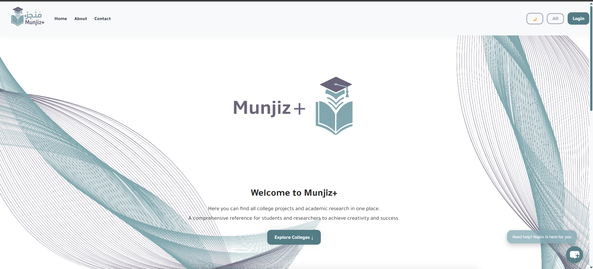
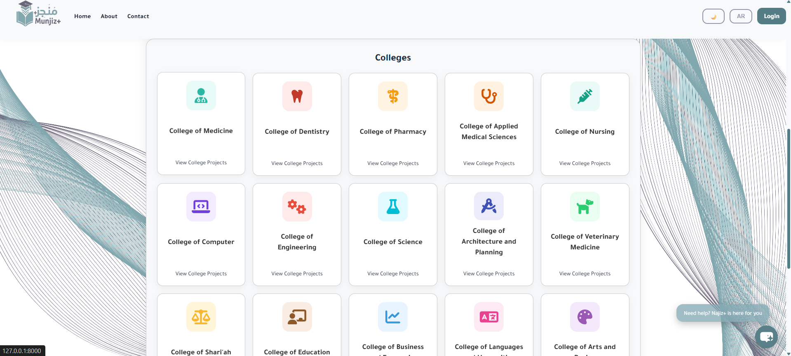
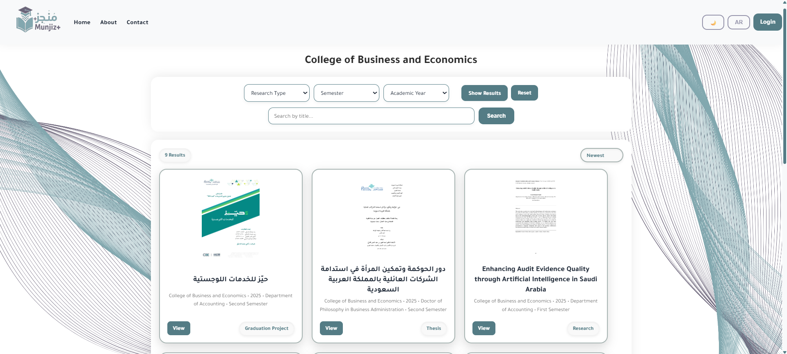
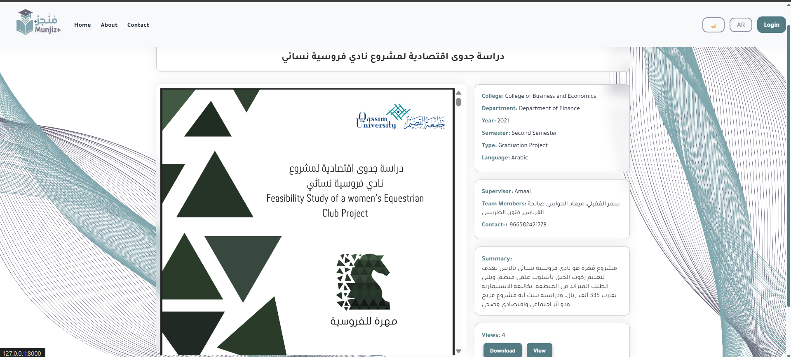
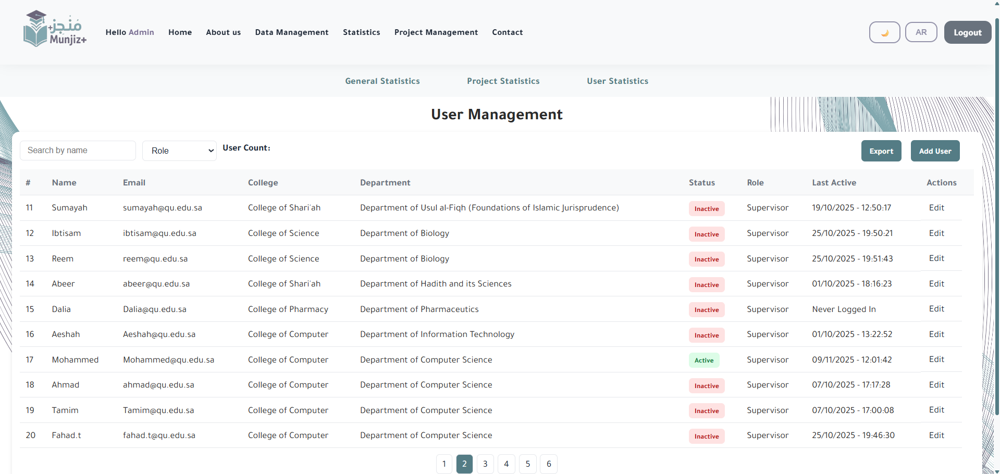
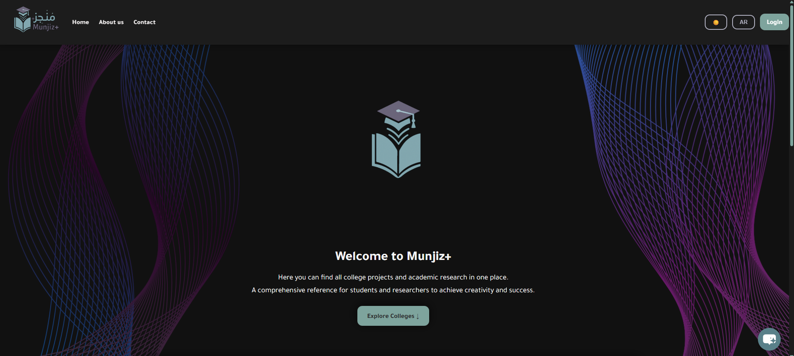
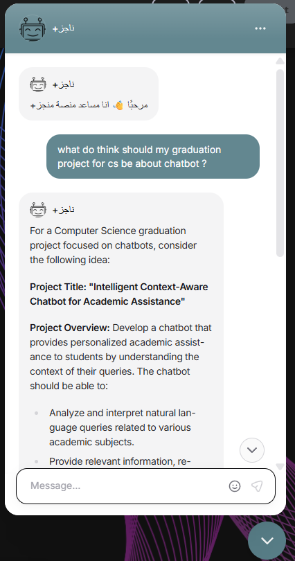

# Munjiz+

Munjiz+ is a digital platform developed for Qassim University to collect, organize, and preserve academic works such as graduation projects, master and PhD theses and research papers.

## Problem
Academic works are often scattered across departments, personal devices, or printed copies, making them difficult for students and researchers to access and benefit from.

## Solution
Munjiz+ provides a centralized platform where academic works are organized and searchable using filters such as:
- College
- Department
- Academic year
- Research type
- Semester
and an AI chatbot

## Features
- Organized academic repository
- Advanced search and filtering
- Arabic and English support
- AI-powered chatbot (Najiz+)
- Responsive design (Desktop & Mobile)
- Dark mode support
- Supervisor upload system
- Admin dashboard

## Screenshots

### Homepage

### Homepage - version 2

### Collage Page

### Details Page

### Admin Panel

### Dark Mode

### Chatbot

## Technologies Used
- Python
- Django
- HTML
- CSS
- JavaScript
- SQLite

## Project Goal
To improve accessibility of academic work, enhance collaboration, and help students build upon previous research instead of starting from scratch.

## Team
- Sally Alkalifah (the leader)
- Aeshah Mohammed 
- Noura Saleh 
- Sahlah Majed 
- Randa Abdullah 
- Reema Mohammed 
